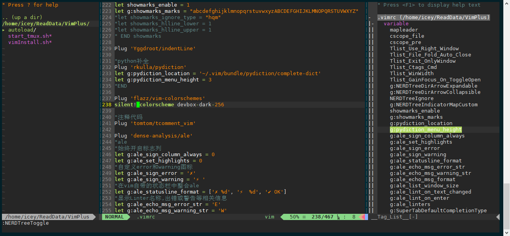

### 简介VimPlus
> 一键配置vim配置，解决vim配置难题，自动完成vim插件安装，打造完美程序猿工作环境（vim）。
> 撸代码、写代码以及炫技三管齐下，大神专用装逼神器，vimplus你值得拥有
### 安装VimPlus
```
git clone https://github.com/IceLeeGit/VimPlus.git
cd ./VimPlus
```
- **github安装**
```
  ./vimInstall.sh
```
- **支持gitee安装**
```
  ./vimInstall.sh gitee
```
### 效果图


### 快捷键简介

|    快捷键    |                 描述                 ||    快捷键    |                 描述                 |
| :----------: | :----------------------------------: |:-:| :-------: | :----------------------------------: |
|   ctrl + n   |       打开/关闭代码资源管理器        ||    , + F5    | 格式化脚本，清除文件中多余的空白字符 |
|       C      |      重新定义资源管理器初始位置      ||    , + M     |      移除 Windows 文件结尾的 ^M      |
|      tl      |          打开/关闭函数列表           ||    , + h     |      查找.c, .cc, .cpp, .h 文件      |
|      tb      |          打开/关闭函数列表           ||     cs"'     |      替换双引号为单引号              |
|     ,+m      |               高亮字符               ||     ds"      |      删除双引号                      |
|   Ctrl + o   |            返回上一次访问            ||   , + tab    |      代码片段补全                    |
|   Ctrl + ]   |               函数跳转               ||   Ctrl + p   |      代码缓存补全                    |
|  Ctrl - W + ]|  用新窗口打开并查看光标下符号的定义  || Ctrl + Space |      开启YCM代码补全                 |
|  Ctrl - W + }| 使用 preview 窗口预览光标下符号的定义||  Ctrl + //   |      注释代码，支持多行注释          |
| Ctrl + c + s |                查找C                 ||    , + \|    |      按竖线对齐                      |
| Ctrl + c + g |             查找函数定义             ||    , + =     |      按等号对齐                      |
| Ctrl + c + c |               查找调用               || shift + 左键 |      选中粘贴                        |
| Ctrl + c + f |               查找文件               ||    , + F11   |      设置粘贴模式                    |
| Ctrl + c + e |           查找字符，全匹配           ||    , + c     |      开启拷贝模式                    |
|   :bn(,bn)   |           跳转下一个标签页           ||      F12     |      切换主题                        |
|   :bf(,bp)   |          跳转到以一个标签页          ||   :b[0-9]    |      跳转到0-9标签页                 |
|  :bd(,bd )   |          删除标签(所有标签)          |
|   Ctrl + 6   |         返回上一次打开标签页         |
